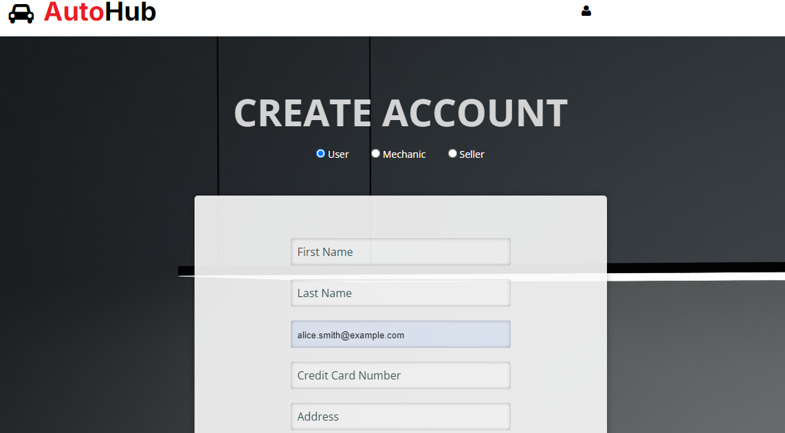

## Portfolio

---

### Machine Learning 

[Back Propagation from scratch on IRIS dataset](/project1)

---
[Student Grade Predictor](/project2)

---

### Web Development

**-Stock Management System**

•	An interactive website developed using HTML/CSS, Flask and sqlite
•	Allows admin to add orders from suppliers,view all orders, view available products, add products in bill and generate bill.

<!-- Carousel for Portfolio -->

  

    

      
    

    

      
    

    

      
    

      

      
    

    

      
    

    

      
    

    <!-- Add more items as needed -->
  

  <a class="carousel-control-prev" href="#carouselExampleControls" role="button" data-slide="prev">
    
    Previous
  </a>
  <a class="carousel-control-next" href="#carouselExampleControls" role="button" data-slide="next">
    
    Next
  </a>

<!-- End Carousel -->

---
**-Expense Management System**

•	Designed and implemented a web-based expense management system following a Software Development Life Cycle (SDLC) methodology 
•	Created System Requirements Specification (SRS) document including UML diagrams
•	Utilized Figma for UI/UX design 
•	Used Flask with HTML/CSS and MSSQL for development

<!-- Carousel for Portfolio -->

  

    

      
    

    

      
    

    

      
    

      

      
    

    
    <!-- Add more items as needed -->
  

  <a class="carousel-control-prev" href="#carouselExampleControls" role="button" data-slide="prev">
    
    Previous
  </a>
  <a class="carousel-control-next" href="#carouselExampleControls" role="button" data-slide="next">
    
    Next
  </a>

<!-- End Carousel -->

---
**-Online Automotive Parts Marketplace**

•	An interactive website implemented using the Software Design Principles and Models to facilitate seamless interactions between buyers, sellers and suppliers.
•	Used Flask with HTML/CSS and MSSQL for development

<!-- Carousel for Portfolio -->

  

    

      
    

    

      
    

    

      
    

      

      
    

    

      
    

    

      
    

    

      
    

    <!-- Add more items as needed -->
  

  <a class="carousel-control-prev" href="#carouselExampleControls" role="button" data-slide="prev">
    
    Previous
  </a>
  <a class="carousel-control-next" href="#carouselExampleControls" role="button" data-slide="next">
    
    Next
  </a>

<!-- End Carousel -->

---
**-Airline Reservation System**

•	Designed and implemented an innovative airline reservation system website with key functionalities including booking and canceling flights (one-way or round-trip), viewing tickets, and providing feedback
•	Used HTML/CSS, MSSQL and PHP for development.

<!-- Carousel for Portfolio -->

  

    

      
    

    

      
    

    

      
    

      

      
    

    

      
    

    

      
    

    <!-- Add more items as needed -->
  

  <a class="carousel-control-prev" href="#carouselExampleControls" role="button" data-slide="prev">
    
    Previous
  </a>
  <a class="carousel-control-next" href="#carouselExampleControls" role="button" data-slide="next">
    
    Next
  </a>

<!-- End Carousel -->
---

