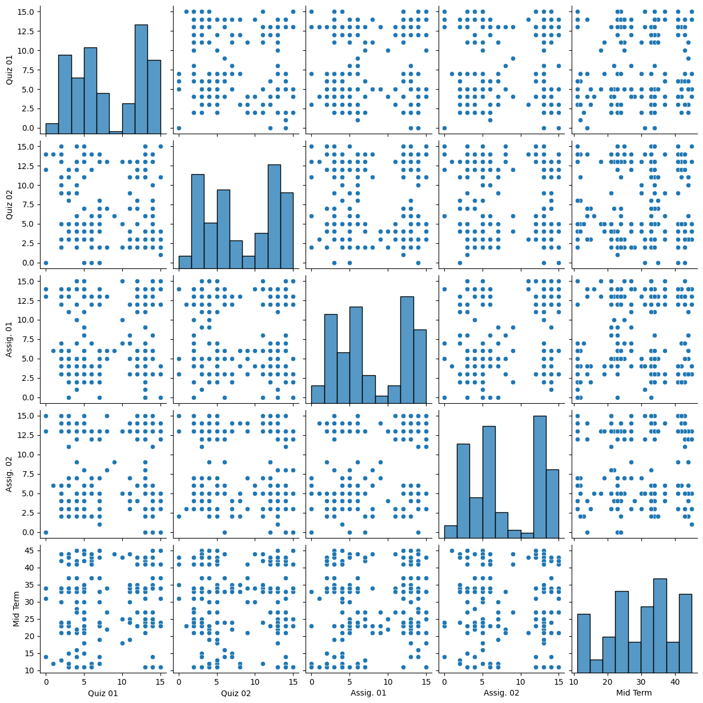

## Student Grade Predictor

**Project description:** A website to predict grade of students based on quiz, assignments and mid term marks using Pandas, scikit-learn, seaborn, matplotlib and Flask.

### 1. Data preprocessing with Pandas

We got data on students marks from Kaggle(https://www.kaggle.com/datasets/datascientist97/university-students-marks-sheet)

### 2. Data Visualization with Matplotlib

### 3. Methodology

MLPClassifier with 4 hidden layers of size 100,80,40 and 20; with 0.001 learning rate and 1000 epochs. 

### 4. Frontend

We integrated the model in HTML/CSS page using Flask.

